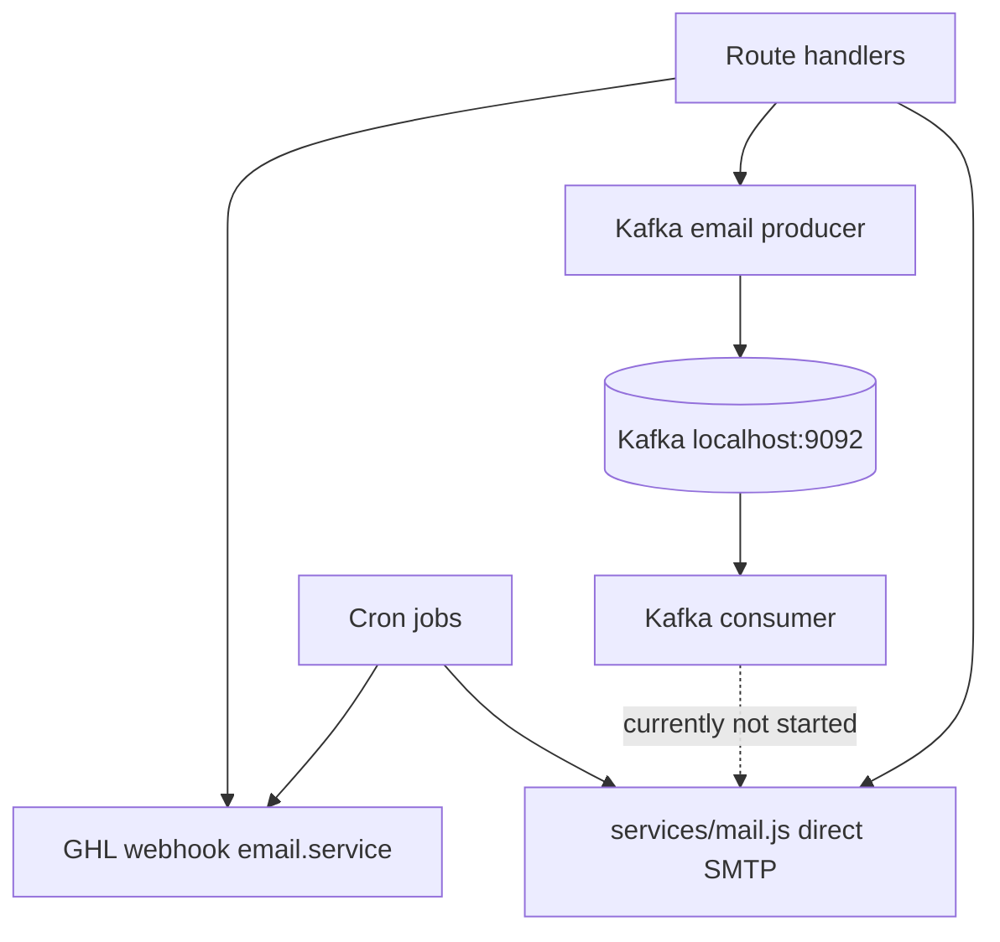
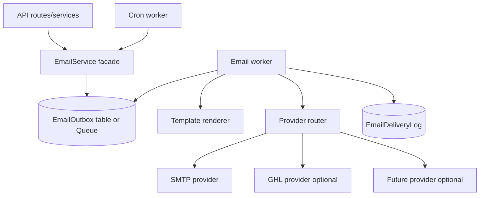
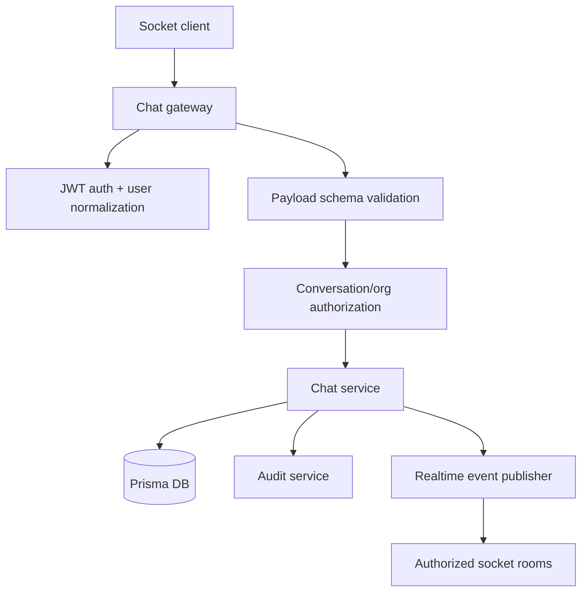
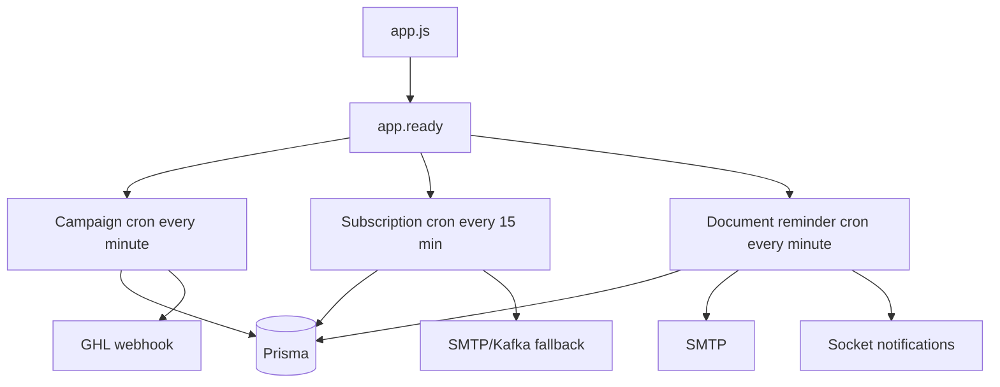
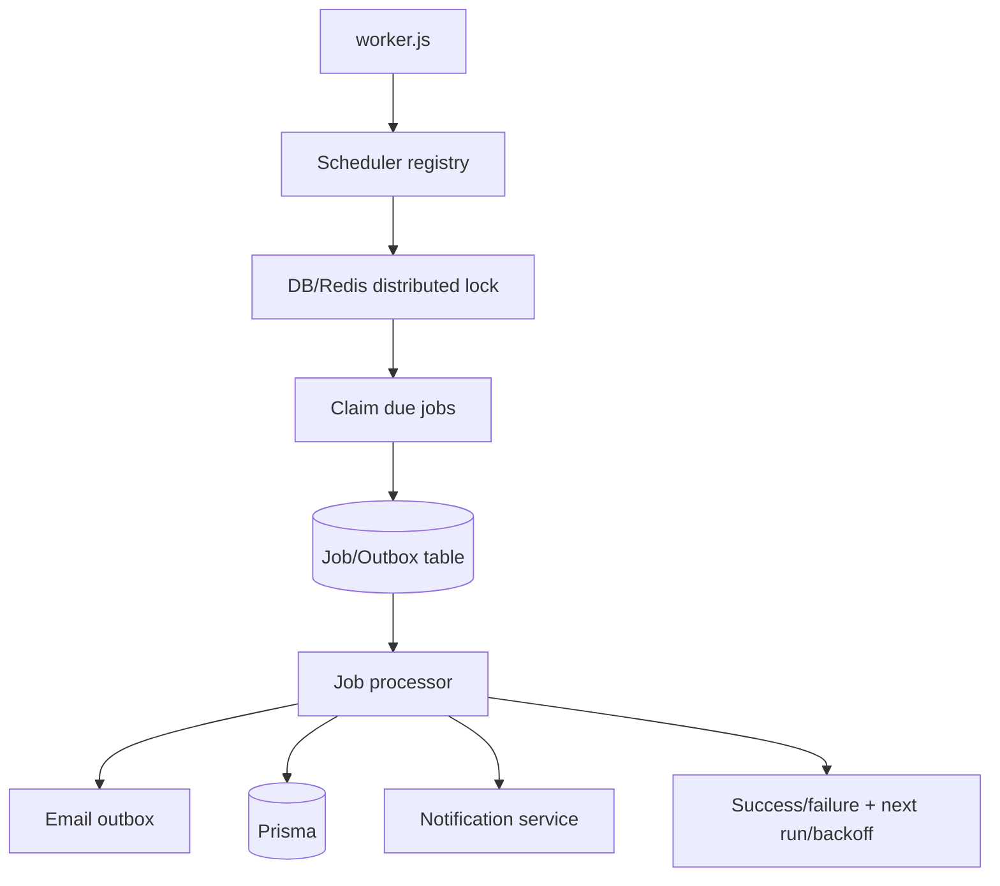

# Backend Mail, Chat Socket, and Cron Review

Date: 2026-07-03  
Project area reviewed: `backend/app.js`, `backend/bin/www`, `backend/services/mail.js`, `backend/services/kafka/email/*`, `backend/modules/email/*`, `backend/plugins/socket.js`, `backend/sockets/chat.socket.js`, `backend/scheduler/*`, and representative mail call sites.

## Executive summary

The backend can start locally, but the current design tightly couples web-server boot with sockets, cron jobs, SMTP, Kafka, GHL webhooks, database writes, and notification fan-out. This makes the server fragile: one process does too many responsibilities, background jobs start during `app.js` import, mail is sent through multiple inconsistent paths, and Socket.IO rooms can be joined from untrusted client-supplied IDs.

The correct architecture should split the backend into:

1. **Web API process**: HTTP routes + Socket.IO gateway only.
2. **Worker process**: email queue consumer and cron/job processor only.
3. **Central mail service**: one API for all emails, with templates, provider fallback, retry, and delivery logs.
4. **Scheduler/job system**: durable jobs with locks, idempotency, retries, and backoff.
5. **Chat gateway/service split**: socket gateway validates/authorizes, service layer persists messages and emits events.

## Current startup validation

I ran bounded startup checks:

```sh
node -e "require('/home/yashdeep/Workspace/LendingCartBackend/backend/app'); setTimeout(() => process.exit(0), 3000);"
node /home/yashdeep/Workspace/LendingCartBackend/backend/bin/www
```

Observed:

- `app.js` import initializes Socket.IO and all schedulers immediately.
- `bin/www` starts the server successfully, then remains running as expected.
- No immediate boot exception was reproduced in the short check.

Important: even though short boot did not crash, the design is still crash-prone because crons and mail dependencies execute inside the same server process.

## High-risk findings

### P0 — `app.js` starts background jobs during app bootstrap

Current code in `backend/app.js`:

```js
app.ready().then(() => {
  campaignScheduler(app);
  subscriptionScheduler(app);
  documentReminderScheduler(app);
});
```

Problems:

- Importing `app.js` for tests/scripts starts cron jobs.
- Every server instance starts the same crons. In PM2 cluster, Docker replicas, or multiple local terminals, jobs run multiple times.
- Crons share the API process. Slow SMTP/Kafka/DB work can affect request latency and server stability.
- No job ownership/locking exists, so duplicate emails/invoices/reminders are possible.

Fix:

- Remove scheduler startup from `app.js`.
- Start crons only from a dedicated worker entrypoint, e.g. `backend/bin/worker.js`.
- Add an environment guard like `ENABLE_CRONS=true` only for the worker process.

Target:

```txt
backend/bin/www          -> starts Fastify HTTP + Socket.IO only
backend/bin/worker.js    -> starts cron scheduler + queue consumers only
backend/app.js           -> builds Fastify app, no long-running side effects
```

---

### P0 — mail system has multiple competing send paths

Current paths:

- `backend/services/mail.js` sends SMTP directly.
- `backend/services/kafka/email/producer.js` queues email to Kafka.
- `backend/services/kafka/email/consumer.js` consumes Kafka emails, but it is commented out in `app.js`.
- `backend/modules/email/email.service.js` sends through GHL webhook instead of the central SMTP/Kafka mail service.
- Several routes call Kafka first and then SMTP fallback.
- `backend/routes/clientPortal/uploadDocuments.js` currently calls Kafka and direct SMTP in the same success path, which can send duplicate emails:

```js
await sendEmailUsingKafka(...);
await sendMail(...);
```

Problems:

- No single source of truth for email delivery.
- Kafka producer uses hard-coded `localhost:9092`.
- Kafka consumer is not started, so queued emails may never send.
- Direct SMTP inside request handlers can slow or fail user requests.
- Duplicate sends are possible.
- Delivery status is not consistently persisted.

Fix:

Create a single mail facade:

```js
await emailService.enqueue({
  template: "brokerWelcome",
  to,
  subject,
  data,
  priority: "normal",
  idempotencyKey,
});
```

All routes should call only this facade. The facade should write to an email outbox/job table or queue. A worker sends emails and updates delivery status.

---

### P0 — hard-coded secrets/defaults in mail and sockets

Current examples:

`backend/services/mail.js`:

```js
const EMAIL_HOST = process.env.SMTP_HOST || "smtp.hostinger.com";
const EMAIL_USER = process.env.SMTP_USER || "mailerbot@vibrantick.in";
const EMAIL_PASSWORD = process.env.SMTP_PASS || "Mailerbot@123";
```

`backend/plugins/socket.js`:

```js
const jwtSecret = process.env.JWT_SECRET || "SecretKey";
```

Problems:

- Security risk: default credentials and default JWT secret allow accidental insecure deployments.
- Local environment bugs are hidden instead of failing with a clear config error.
- If SMTP credentials are invalid, failures happen at runtime in random routes/jobs.

Fix:

- Remove all secret defaults.
- Validate required env variables once during process startup.
- Fail fast in production with clear messages.
- In local dev, allow explicit feature disabling, e.g. `EMAIL_ENABLED=false`, instead of unsafe defaults.

---

### P0 — socket room joins trust client-supplied organization/client IDs

Current code in `backend/plugins/socket.js`:

```js
socket.on("joinBrokerRoom", (brokerOrgId) => socket.join(`broker_${brokerOrgId}`));
socket.on("joinLenderRoom", (lenderOrgId) => socket.join(`lender_${lenderOrgId}`));
socket.on("joinPlatformRoom", (platformOrgId) => socket.join(`platform_${platformOrgId}`));
socket.on("joinClientRoom", (clientId) => socket.join(`client_${clientId}`));
```

Problem:

Any authenticated socket can request arbitrary rooms if it knows or guesses an ID. This is a data-leak and notification-leak risk.

Fix:

- Do not accept org/client room IDs directly from the client.
- Derive allowed rooms from `socket.user` and database authorization.
- For conversation rooms, keep `assertCanAccessConversation` before joining.
- For organization rooms, verify the user's org membership before joining.

Correct pattern:

```js
const rooms = await resolveAllowedRooms(prisma, socket.user);
for (const room of rooms) socket.join(room);
```

---

### P0 — cron jobs have no locking, idempotency, retry, or overlap protection

Affected files:

- `backend/scheduler/campaign.scheduler.js`
- `backend/scheduler/subscription.scheduler.js`
- `backend/scheduler/documentReminder.scheduler.js`

Problems:

- Multiple server instances run the same jobs.
- A long job can overlap with the next cron tick.
- If the process crashes after sending an email but before updating DB state, the email can be sent again.
- Failed reminders remain due and retry every minute with no backoff.
- Billing invoice number generation is race-prone.

Fix:

Use a durable job pattern:

- Select due work with a DB transaction.
- Mark rows `PROCESSING` with `lockedBy`, `lockedUntil`, `attempts`.
- Send outside or inside a controlled transactional outbox flow.
- On success mark `SENT` / update `nextRunAt`.
- On failure increment attempts and set `nextRunAt` with exponential backoff.
- Enforce idempotency with unique keys.

## Detailed module review

## 1. Mail system review

### Current design



### Main issues

| Severity | Issue | Evidence | Impact |
|---|---|---|---|
| P0 | Hard-coded SMTP credentials | `services/mail.js` | Security leak, wrong env masked |
| P0 | Kafka broker hard-coded | `services/kafka/email/*.js` | Local/prod config mismatch |
| P0 | Kafka consumer disabled | commented in `app.js` | Queued emails may never send |
| P0 | Duplicate send path | `routes/clientPortal/uploadDocuments.js` | Duplicate broker emails |
| P1 | SMTP verify runs on module import | `services/mail.js` IIFE | Startup side effects and noisy logs |
| P1 | Request handlers send SMTP directly | many routes | Slow/failing email affects API requests |
| P1 | GHL service lacks env validation | `modules/ghl/ghl.service.js` | Runtime `Invalid URL`/webhook failures |
| P1 | No central delivery log/retry | scattered calls | No operational visibility |

### Correct mail architecture



### Recommended data model

Add or standardize an email outbox/delivery table:

```txt
EmailOutbox
- id
- to
- cc
- bcc
- subject
- templateKey
- templateData JSON
- html
- text
- status: PENDING | PROCESSING | SENT | FAILED | DEAD
- provider: SMTP | GHL | SES
- attempts
- maxAttempts
- nextAttemptAt
- lockedBy
- lockedUntil
- idempotencyKey unique nullable
- lastError
- sentAt
- createdAt
- updatedAt
```

### Mail fix plan

1. Remove hard-coded SMTP/JWT/Kafka defaults.
2. Create `services/email/email.service.js` as the only mail API.
3. Replace all direct `sendMail`/`sendEmailUsingKafka` route calls with `emailService.enqueue(...)`.
4. Move Kafka/SMTP/GHL into provider adapters.
5. Start email sending only in `bin/worker.js`.
6. Add retries with backoff and dead-letter status.
7. Add idempotency keys for business events:
   - `broker-created:{brokerId}`
   - `document-uploaded:{uploadId}:broker-notify`
   - `trial-ending:{subscriptionId}`
   - `document-reminder:{scheduleId}:{scheduledAt}`
8. Add tests for duplicate prevention and fallback behavior.

## 2. Chat socket review

### Current design

- `backend/plugins/socket.js` initializes Socket.IO on the Fastify server.
- JWT auth is done in `io.use`.
- `backend/sockets/chat.socket.js` registers event handlers and performs DB writes directly.
- `services/messagingAccess.js` contains useful authorization helpers for conversation access.

### Main issues

| Severity | Issue | Evidence | Impact |
|---|---|---|---|
| P0 | JWT fallback secret | `JWT_SECRET || "SecretKey"` | Auth bypass risk in misconfigured env |
| P0 | Arbitrary room joins | `joinBrokerRoom`, `joinLenderRoom`, etc. | Cross-tenant notification leak |
| P1 | `origin: "*"` with credentials | socket and HTTP CORS | Insecure and can behave inconsistently |
| P1 | No payload schema validation | socket events | Bad payloads cause generic errors |
| P1 | No socket rate limiting | `sendMessage` | Spam/DoS risk |
| P1 | DB/audit work inside event handler | `chat.socket.js` | Slow socket path and harder testing |
| P2 | No Redis adapter | single-process Socket.IO | Breaks horizontal scale |
| P2 | `response` object unused | `chat.socket.js` | Sender does not receive clear ack/result |

### Correct chat architecture



### Socket fix plan

1. Make `JWT_SECRET` required. Do not use fallback.
2. Replace `origin: "*"` with env allowlist:

   ```txt
   SOCKET_CORS_ORIGINS=http://localhost:3000,http://localhost:5173,https://app.example.com
   ```

3. Remove direct client-controlled room joins or guard them:

   ```js
   socket.on("joinBrokerRoom", async () => {
     if (socket.user.orgType !== "BROKER") return socket.emit("socketError", ...);
     socket.join(`broker_${socket.user.organizationId}`);
   });
   ```

4. Add payload validation using existing `zod` dependency:

   ```js
   const SendMessageSchema = z.object({
     conversationId: z.string().min(1),
     type: z.enum(["TEXT", "FILE"]),
     text: z.string().trim().max(5000).optional(),
     fileUrl: z.string().url().optional(),
     fileName: z.string().max(255).optional(),
   });
   ```

5. Add per-socket/user rate limit for `sendMessage`.
6. Use acknowledgement callbacks:

   ```js
   socket.on("sendMessage", async (payload, ack) => {
     const result = await chatService.sendMessage(socket.user, payload);
     ack?.({ success: true, data: result });
   });
   ```

7. Split code:

   ```txt
   sockets/chat.gateway.js       -> socket events only
   services/chat.service.js      -> DB write/read business logic
   services/chat.events.js       -> room emission logic
   services/messagingAccess.js   -> authorization helpers
   ```

8. For production multi-instance, add Redis adapter:

   ```txt
   @socket.io/redis-adapter + ioredis
   ```

## 3. Cron/scheduler review

### Current design



### Main issues

| Severity | Issue | Impact |
|---|---|---|
| P0 | Crons start from API process | Server instability, duplicate jobs |
| P0 | No distributed lock | Multiple instances send same email/invoice |
| P0 | No overlap protection | Slow previous run can overlap next tick |
| P1 | No retry/backoff model | Failed jobs repeat too frequently or silently fail |
| P1 | Campaign sends all recipients inline | Long-running minute cron, partial duplicate risk |
| P1 | Subscription invoice number generated outside transaction | Race condition under concurrency |
| P1 | Document reminders do not mark failed schedule attempt/backoff | Same failing reminder retries every minute |
| P2 | Excessive `console.log` in cron | Noisy logs, hard to monitor |

### Correct scheduler architecture



### Cron fix plan

#### Step 1: isolate workers

Create:

```txt
backend/bin/worker.js
backend/scheduler/index.js
```

`bin/worker.js` should be the only place that starts schedulers:

```js
require("dotenv").config();
const app = require("../app");
const startSchedulers = require("../scheduler");

app.ready().then(async () => {
  if (process.env.ENABLE_CRONS !== "true") {
    app.log.warn("Crons disabled. Set ENABLE_CRONS=true to run worker.");
    return;
  }
  await startSchedulers(app);
});
```

Then remove scheduler startup from `app.js`.

#### Step 2: add lock helper

Use DB advisory locks if Postgres is used, or a lock table if DB-agnostic.

Example lock table:

```txt
JobLock
- name unique
- lockedBy
- lockedUntil
- updatedAt
```

Each cron tick:

1. Acquire lock for job name.
2. Skip if another worker owns the lock.
3. Process a bounded batch.
4. Release or let TTL expire.

#### Step 3: make jobs idempotent

Examples:

- Campaign recipient send key: `campaign:{campaignId}:recipient:{recipientId}:run:{scheduledAt}`
- Document reminder key: `doc-reminder:{scheduleId}:{nextRunAt}`
- Subscription invoice key: `subscription-invoice:{subscriptionId}:{periodStart}`

Add DB unique constraints where possible.

#### Step 4: move email sending out of cron loops

Crons should create email outbox records, not send SMTP/GHL directly.

Bad:

```js
await sendMail({ to, subject, html });
```

Better:

```js
await emailService.enqueue({ template, to, subject, data, idempotencyKey });
```

#### Step 5: replace noisy logs with structured logs

Use `fastify.log.info/error` or existing `contextLogger`, not raw `console.log`, especially inside every-minute jobs.

## Recommended target folder structure

```txt
backend/
  app.js                         # app builder only; no cron startup
  bin/
    www                          # HTTP + Socket.IO process
    worker.js                    # cron + queue worker process
  config/
    env.js                       # required env validation
  services/
    email/
      email.service.js           # enqueue API used by routes/jobs
      email.worker.js            # sends pending emails
      email.renderer.js          # template rendering
      providers/
        smtp.provider.js
        ghl.provider.js
    chat/
      chat.service.js            # message business logic
      chat.events.js             # fan-out helper
    jobs/
      lock.service.js
      idempotency.service.js
  sockets/
    socket.plugin.js             # Socket.IO setup
    chat.gateway.js              # validated socket event handlers
  scheduler/
    index.js
    campaign.scheduler.js
    subscription.scheduler.js
    documentReminder.scheduler.js
```

## Local crash stabilization checklist

Apply these first before larger refactor:

1. **Stop crons from starting in `app.js`.**
   - Add `bin/worker.js`.
   - Gate cron startup with `ENABLE_CRONS=true`.
2. **Remove unsafe env defaults.**
   - `JWT_SECRET` must be required.
   - SMTP credentials must be required only if `EMAIL_ENABLED=true`.
   - Kafka brokers must come from `KAFKA_BROKERS`.
3. **Make mail non-blocking.**
   - In local dev, allow `EMAIL_ENABLED=false` and log email payloads instead of connecting SMTP.
4. **Fix duplicate email in `routes/clientPortal/uploadDocuments.js`.**
   - Use either queue or SMTP fallback, not both on success.
5. **Disable Kafka producer when Kafka is not configured.**
   - Do not attempt `localhost:9092` unless explicitly configured.
6. **Secure socket room joins.**
   - Derive rooms from authenticated user, not arbitrary payload IDs.
7. **Add process-level safety logs.**
   - Add `process.on("unhandledRejection")` and `process.on("uncaughtException")` logging in entrypoints, then exit/restart under PM2/systemd for fatal errors.

## Suggested environment variables

```env
NODE_ENV=development
PORT=4000
DATABASE_URL=...
JWT_SECRET=...

# HTTP / socket CORS
CORS_ORIGINS=http://localhost:3000,http://localhost:5173
SOCKET_CORS_ORIGINS=http://localhost:3000,http://localhost:5173

# Workers
ENABLE_CRONS=false
WORKER_ID=local-worker-1

# Email
EMAIL_ENABLED=false
EMAIL_PROVIDER=SMTP
SMTP_HOST=...
SMTP_PORT=465
SMTP_USER=...
SMTP_PASS=...
SMTP_FROM=no-reply@example.com

# Optional queue
EMAIL_QUEUE_DRIVER=database
KAFKA_ENABLED=false
KAFKA_BROKERS=localhost:9092
KAFKA_EMAIL_TOPIC=email-sending

# Optional GHL
GHL_ENABLED=false
GHL_WEBHOOK_URL=...
```

## Priority implementation roadmap

### Phase 1 — stop crashes and duplicates

- [ ] Remove scheduler startup from `app.js`.
- [ ] Add `bin/worker.js`.
- [ ] Add env validation module.
- [ ] Remove default SMTP credentials and default JWT secret.
- [ ] Fix duplicate email send in `clientPortal/uploadDocuments.js`.
- [ ] Make Kafka optional and env-driven.
- [ ] Restrict socket room joins.

### Phase 2 — centralize mail

- [ ] Create central `services/email` module.
- [ ] Replace route-level SMTP/Kafka calls.
- [ ] Add `EmailOutbox` table or queue abstraction.
- [ ] Add worker to process email outbox.
- [ ] Add retry/backoff/dead-letter handling.
- [ ] Add delivery logs visible to admins.

### Phase 3 — reliable schedulers

- [ ] Add distributed job lock.
- [ ] Add job idempotency keys.
- [ ] Move campaign recipient sends to outbox jobs.
- [ ] Move document reminder sends to outbox jobs.
- [ ] Wrap subscription billing changes/invoice creation in transactions.
- [ ] Add cron metrics and structured logs.

### Phase 4 — socket production readiness

- [ ] Add zod validation for socket events.
- [ ] Add ack responses for client UX.
- [ ] Add rate limiting.
- [ ] Add Redis Socket.IO adapter for multi-instance deployment.
- [ ] Move chat business logic from socket handler to service layer.

## Final target behavior

After the fixes:

- Starting the API server does not start cron jobs.
- Local development can run without Kafka/SMTP/GHL by explicitly disabling those features.
- All emails go through one service and are idempotent.
- Workers can retry failed emails/jobs safely.
- Multiple server instances do not duplicate cron work.
- Socket clients cannot join rooms outside their authorized tenant/conversation.
- Crashes become easier to diagnose because startup config is validated and background work is isolated from the API process.
